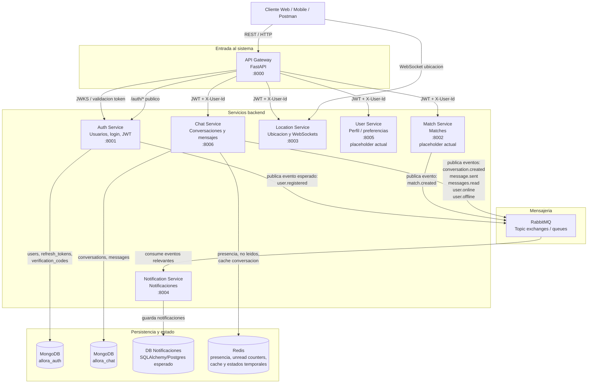
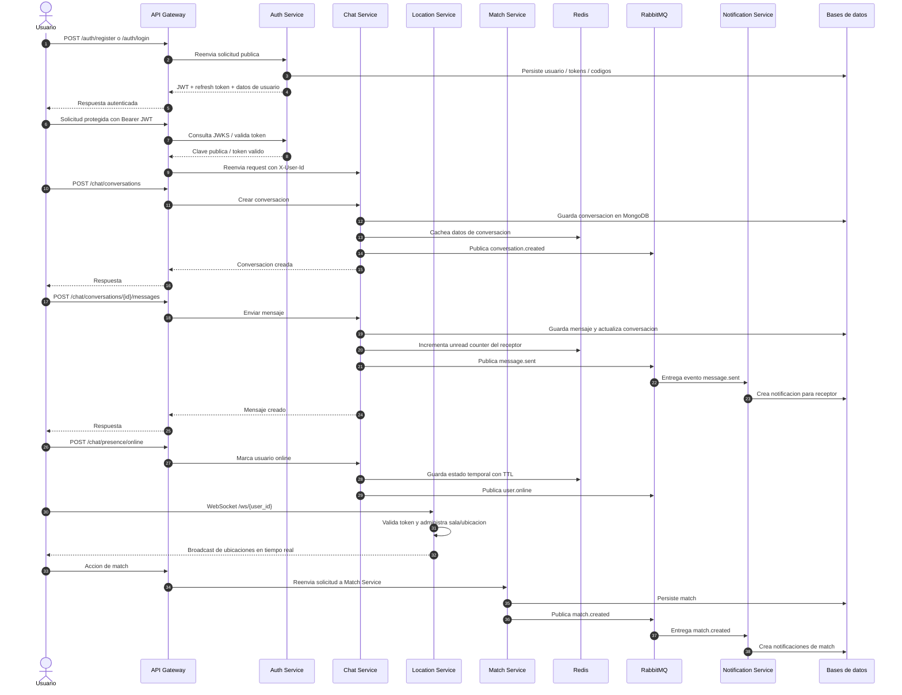

# Allora - Arquitectura Backend

Allora esta estructurado como un backend de microservicios con una puerta de entrada principal, servicios especializados, persistencia por dominio, Redis para estados temporales/cache y RabbitMQ para comunicacion basada en eventos.

## Diagrama General

## Flujo Completo de la Aplicacion

