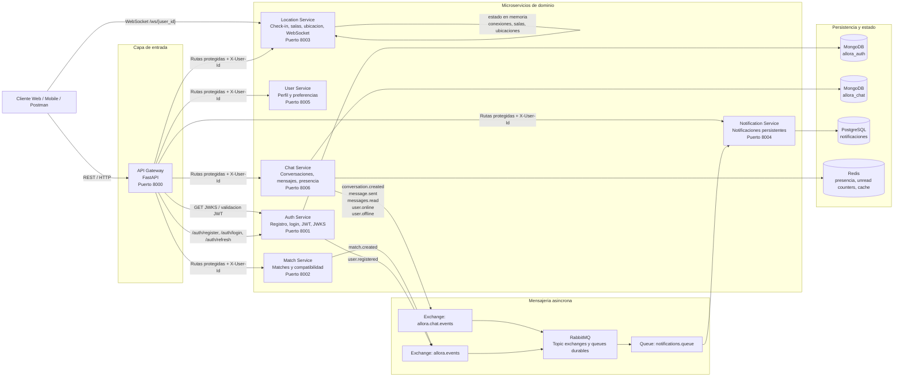
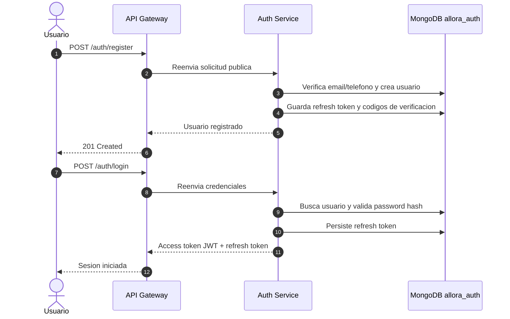
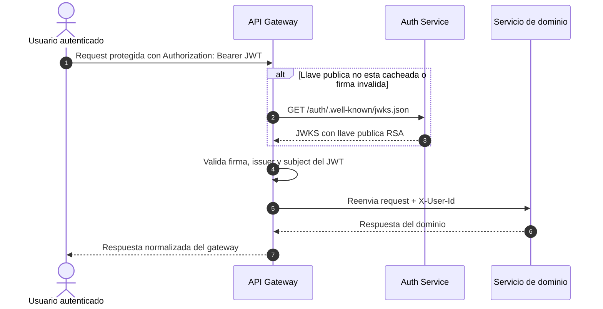
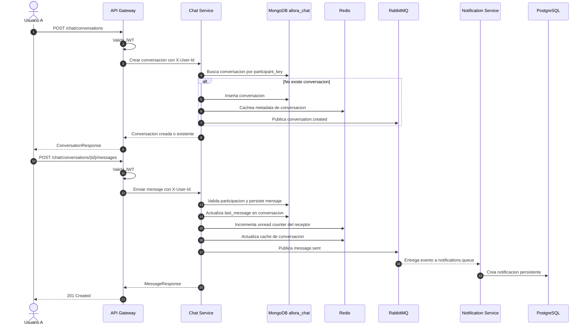
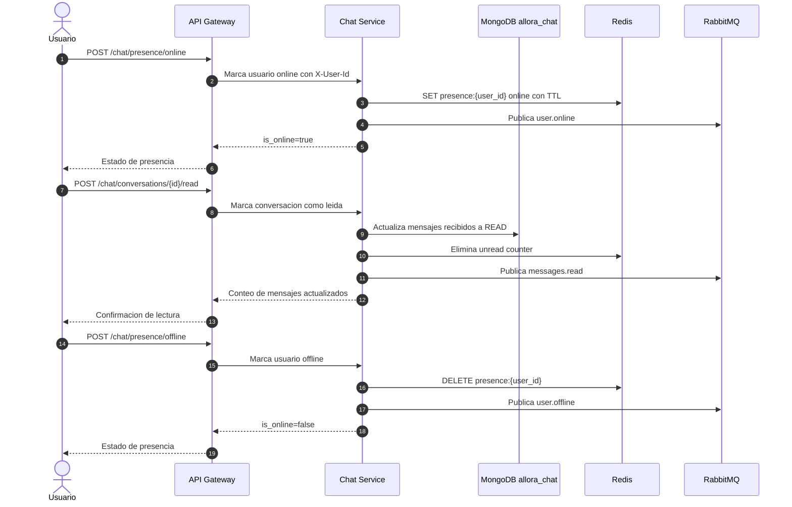
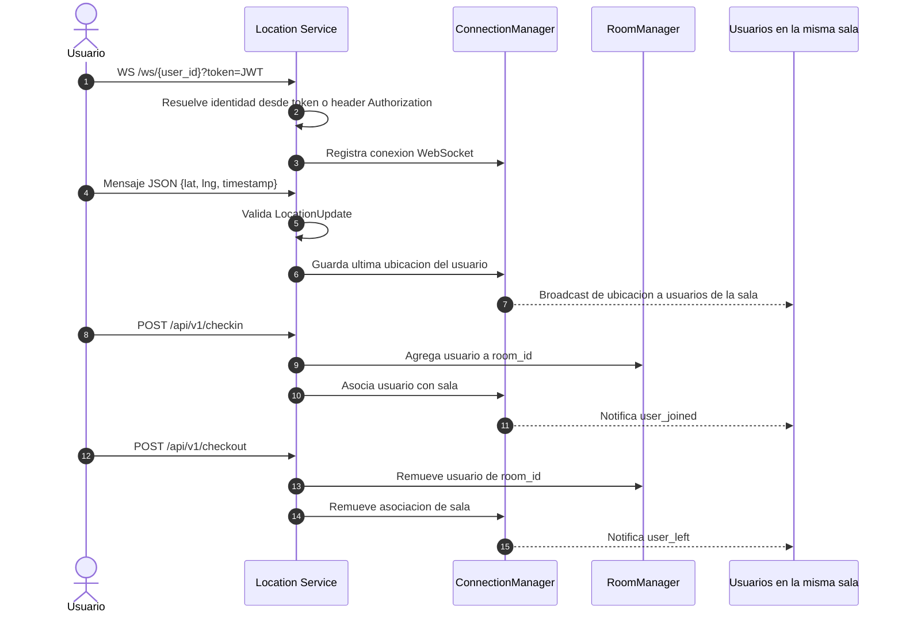
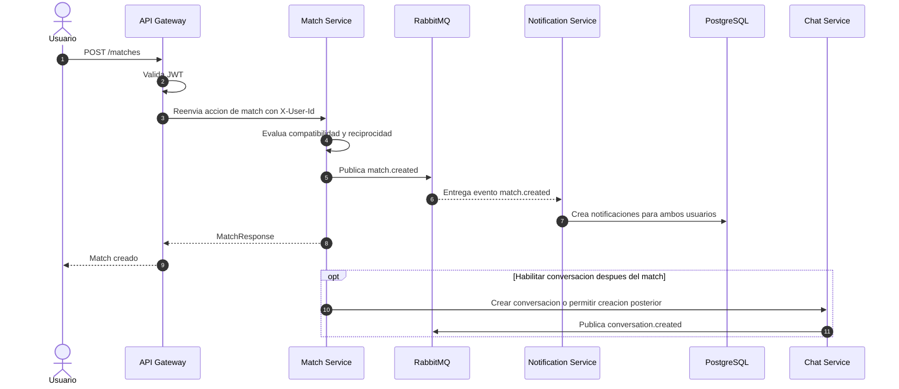
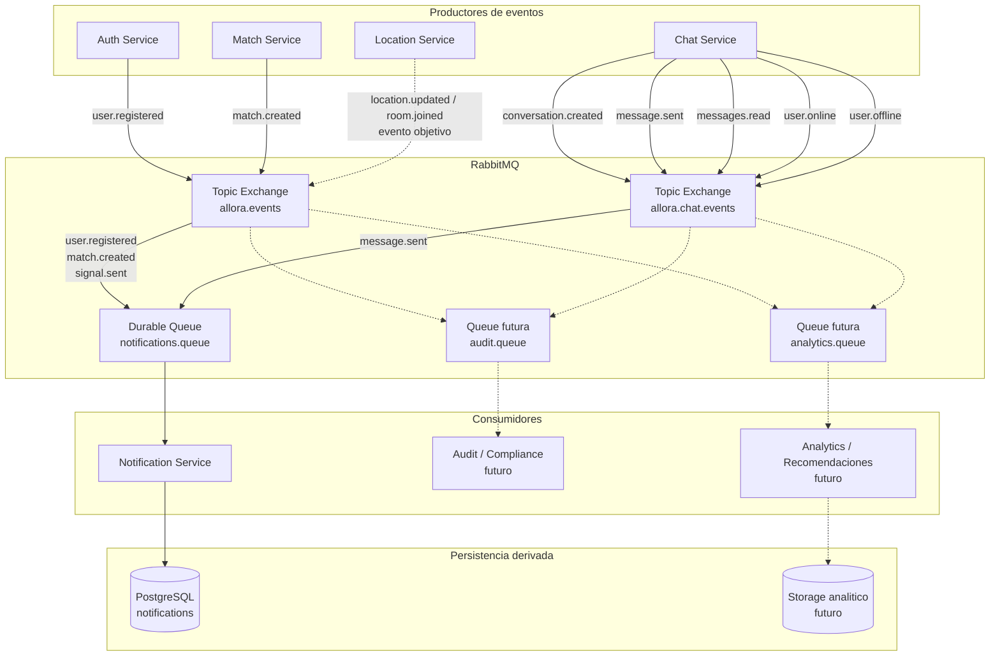

---

## 1. Diagrama de arquitectura general

---

## 2. Diagramas de secuencia

### 2.1 Registro, login y emision de tokens

### 2.2 Solicitud protegida mediante gateway

### 2.3 Creacion de conversacion y envio de mensaje

### 2.4 Lectura de mensajes y presencia

### 2.5 Ubicacion en tiempo real por WebSocket

### 2.6 Match y notificacion asincrona

---

## 3. Diagrama de eventos / event-driven architecture

