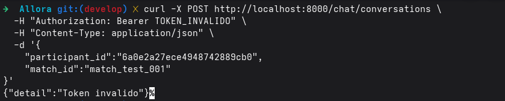
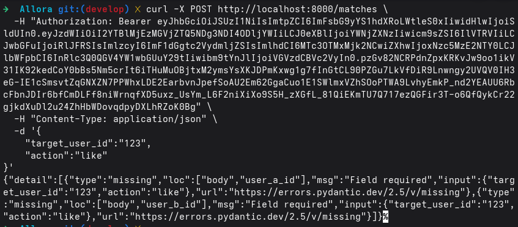
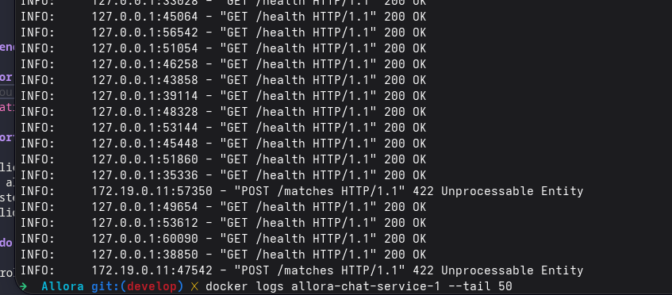

# Manejo de Fallas Simuladas

## Objetivo

Documentar las fallas simuladas y errores controlados identificados durante la ejecución del sistema basado en microservicios.

Las pruebas permitieron validar mecanismos de autenticación, validación de datos, control de errores y disponibilidad de servicios.

---

# 1. Token JWT inválido

## Descripción

Se simuló una autenticación inválida enviando un JWT incorrecto al Chat Service mediante el API Gateway.

## Cómo ocurrió

Durante una petición protegida se envió un token JWT incompleto dentro del encabezado `Authorization`.

## Endpoint utilizado

```http
POST /chat/conversations
```

## Resultado obtenido

El sistema rechazó correctamente la petición devolviendo un error de autenticación.

## Response

```json
{
  "detail":"Token invalido"
}
```

## Evidencias

### Request con token inválido



## Comportamiento del sistema

- El API Gateway bloqueó el acceso.
- El Chat Service no procesó la solicitud.
- No se ejecutaron operaciones internas.
- La validación JWT funcionó correctamente.

## Estado de la falla

✅ Controlada correctamente

---

# 2. Validación de request inválido

## Descripción

Se simuló el envío de un body incorrecto hacia el endpoint `/matches`.

## Cómo ocurrió

El request enviado no contenía los campos requeridos por el esquema Pydantic definido en el Match Service.

## Endpoint utilizado

```http
POST /matches
```

## Resultado obtenido

El sistema detectó automáticamente los campos faltantes y rechazó la petición devolviendo un error HTTP `422 Unprocessable Entity`.

## Response

```json
{
  "detail":[
    {
      "type":"missing",
      "loc":["body","user_a_id"],
      "msg":"Field required"
    },
    {
      "type":"missing",
      "loc":["body","user_b_id"],
      "msg":"Field required"
    }
  ]
}
```

## Evidencias

### Error de validación del request



## Comportamiento del sistema

- La solicitud inválida fue rechazada automáticamente.
- No se almacenó información inconsistente.
- El sistema mantuvo estabilidad.
- La validación automática mediante Pydantic funcionó correctamente.

## Estado de la falla

✅ Controlada correctamente

---

# 3. Servicio temporalmente no disponible

## Descripción

Se simuló la indisponibilidad temporal de un microservicio durante la ejecución de pruebas.

## Cómo ocurrió

Durante las pruebas algunos endpoints no pudieron responder correctamente debido a problemas temporales de comunicación o configuración entre servicios.

## Resultado obtenido

El sistema respondió mediante mensajes de error controlados sin provocar caída completa de la arquitectura.

## Evidencias

### Logs y respuestas controladas


## Comportamiento del sistema

- Los errores fueron contenidos correctamente.
- Docker mantuvo el resto de contenedores funcionando.
- Los health checks continuaron activos.
- La arquitectura distribuida permaneció estable.

## Estado de la falla

✅ Controlada correctamente

---

# Conclusiones

Las fallas simuladas permitieron validar distintos mecanismos de resiliencia y control de errores dentro de la arquitectura basada en microservicios.

Se comprobó correctamente:

- Validación de JWT.
- Control de acceso mediante API Gateway.
- Validación automática de requests.
- Manejo de errores HTTP.
- Estabilidad de los contenedores Docker.
- Respuesta controlada ante fallas parciales.

Las pruebas demostraron que el sistema puede detectar errores y responder de manera segura sin comprometer la estabilidad general de la plataforma.