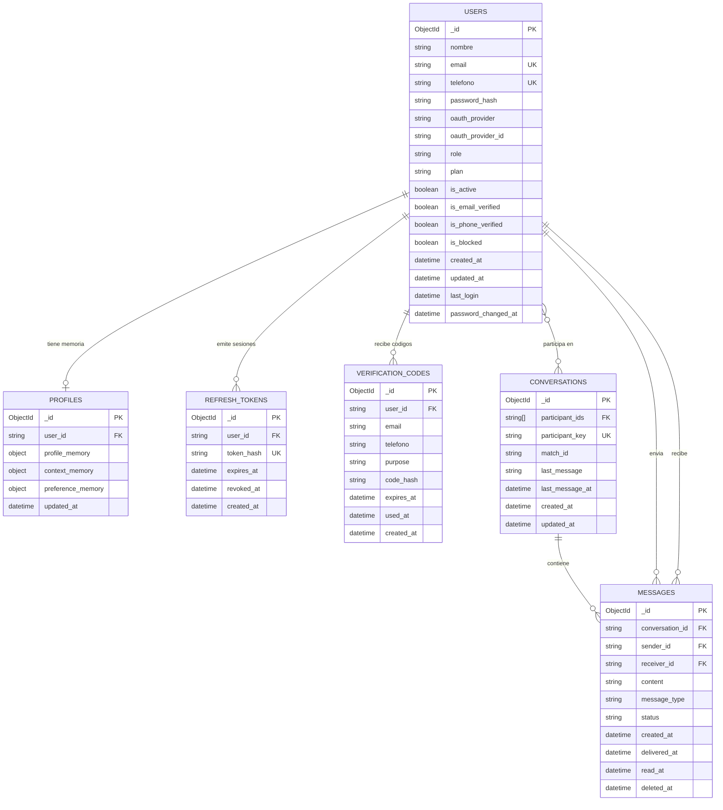

# Modelo de Datos

## Base de datos NoSQL - MongoDB

El backend usa MongoDB para persistir los dominios de autenticacion y chat. Las colecciones se separan por base de datos logica para mantener independencia entre microservicios:

- `allora_auth`: usuarios, memoria de perfil, tokens de sesion y codigos de verificacion.
- `allora_chat`: conversaciones y mensajes.

### Colecciones por base de datos

| Base de datos | Coleccion | Microservicio propietario | Proposito |
|---|---|---|---|
| `allora_auth` | `users` | Auth Service | Identidad, credenciales, rol, plan y estado de cuenta. |
| `allora_auth` | `profiles` | Auth Service | Memoria de perfil, contexto y preferencias generadas durante onboarding. |
| `allora_auth` | `refresh_tokens` | Auth Service | Tokens de renovacion con hash, expiracion y revocacion. |
| `allora_auth` | `verification_codes` | Auth Service | Codigos de verificacion de email, telefono y recuperacion de password. |
| `allora_chat` | `conversations` | Chat Service | Conversaciones entre dos participantes, ultimo mensaje y relacion opcional con match. |
| `allora_chat` | `messages` | Chat Service | Mensajes persistidos, emisor, receptor, estado de entrega/lectura y borrado logico. |

### Indices principales

| Coleccion | Indice | Tipo |
|---|---|---|
| `users` | `email` | Unico parcial cuando `email` es string. |
| `users` | `telefono` | Unico parcial cuando `telefono` es string. |
| `users` | `oauth_provider`, `oauth_provider_id` | Unico parcial para cuentas OAuth. |
| `refresh_tokens` | `token_hash` | Unico. |
| `refresh_tokens` | `user_id`, `expires_at` | Consulta por usuario y limpieza por expiracion. |
| `verification_codes` | `code_hash` | Busqueda de codigo. |
| `verification_codes` | `purpose`, `email`, `telefono` | Verificacion por canal y proposito. |
| `conversations` | `participant_key` | Unico para evitar conversaciones duplicadas entre los mismos usuarios. |
| `conversations` | `participant_ids`, `match_id`, `updated_at` | Listado por usuario, asociacion con match y ordenamiento reciente. |
| `messages` | `conversation_id`, `created_at` | Paginacion cronologica de mensajes por conversacion. |
| `messages` | `receiver_id`, `status` | Busqueda de mensajes pendientes/leidos por receptor. |
| `messages` | `sender_id`, `created_at` | Historial por emisor. |
