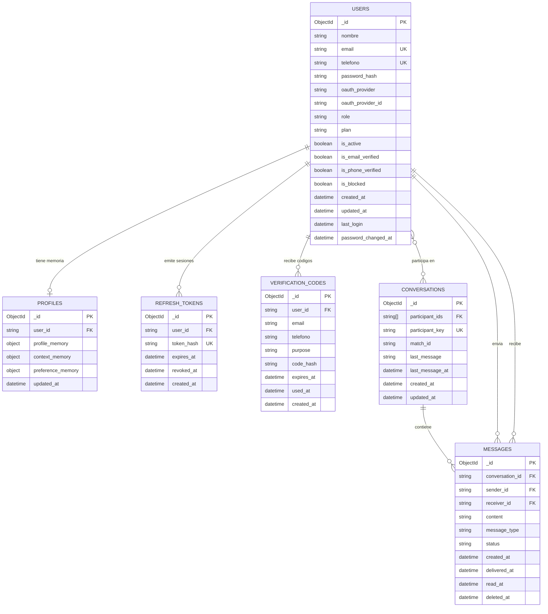

# Modelo de Datos

## Base de datos NoSQL - MongoDB

El backend usa MongoDB para persistir los dominios de autenticacion y chat. 

## Modelo de Entidades — Backend Allora

### USERS

Entidad principal que registra a cada usuario dado de alta dentro de la plataforma Allora de manera individual.

| Atributo | Descripción |
|---|---|
| `_id` | Identificador único del usuario generado por MongoDB. |
| `nombre` | Nombre de usuario dentro de la plataforma. |
| `email` | Correo electrónico del usuario. Tiene restricción `unique` para evitar registros duplicados. |
| `telefono` | Número telefónico del usuario. Funciona como segunda opción de registro y posee restricción `unique`. |
| `password_hash` | Contraseña almacenada de forma segura mediante hash. |
| `oauth_provider` | Proveedor externo de autenticación utilizado por el usuario. |
| `oauth_provider_id` | Identificador del proveedor OAuth asociado al usuario. |
| `role` | Rol del usuario dentro del sistema. |
| `plan` | Plan asociado al usuario dentro de la plataforma. |
| `is_active` | Indica si la cuenta se encuentra activa. |
| `is_email_verified` | Indica si el correo electrónico fue verificado. |
| `is_phone_verified` | Indica si el número telefónico fue verificado. |
| `is_blocked` | Indica si el usuario fue bloqueado dentro de la plataforma. |
| `created_at` | Fecha y hora de creación de la cuenta. |
| `updated_at` | Fecha y hora de la última actualización del usuario. |
| `last_login` | Fecha y hora del último inicio de sesión. |
| `password_changed_at` | Fecha y hora del último cambio de contraseña. |

---

### PROFILES

Entidad asociada de manera individual a un usuario. Contiene información flexible relacionada con el perfil, gustos y preferencias del usuario.

| Atributo | Descripción |
|---|---|
| `_id` | Identificador único del documento de perfil. |
| `user_id` | Identificador del usuario propietario del perfil. |
| `profile_memory` | Objeto flexible que almacena gustos, datos personales y características del usuario. |
| `context_memory` | Objeto flexible que almacena las interacciones y contexto del usuario. |
| `preference_memory` | Objeto flexible que almacena preferencias personalizadas del usuario. |
| `updated_at` | Fecha y hora de la última actualización del perfil. |

---

### REFRESH_TOKENS

Entidad utilizada para persistir los tokens de renovación de sesión.

| Atributo | Descripción |
|---|---|
| `_id` | Identificador único del refresh token. |
| `user_id` | Identificador del usuario dueño del token. |
| `token_hash` | Hash seguro del refresh token. |
| `expires_at` | Fecha y hora de expiración del token. |
| `revoked_at` | Fecha y hora en la que el token fue revocado. Si es `null`, el token sigue vigente mientras no haya expirado. |
| `created_at` | Fecha y hora de creación del token. |

---

### VERIFICATION_CODES

Entidad utilizada para almacenar códigos temporales de verificación.

| Atributo | Descripción |
|---|---|
| `_id` | Identificador único del código de verificación. |
| `user_id` | Identificador del usuario relacionado con el código. Puede existir cuando el usuario ya fue creado. |
| `email` | Correo electrónico asociado al código cuando el propósito involucra email. |
| `telefono` | Número telefónico asociado al código cuando el propósito involucra SMS o validación telefónica. |
| `purpose` | Propósito del código. Ejemplos: `EMAIL_VERIFY`, `PHONE_VERIFY`, `PASSWORD_RESET`. |
| `code_hash` | Hash seguro del código de verificación. |
| `expires_at` | Fecha y hora de expiración del código. |
| `used_at` | Fecha y hora en la que el código fue utilizado. |
| `created_at` | Fecha y hora de creación del código. |

---

### CONVERSATIONS

Entidad que representa una conversación entre dos usuarios dentro de la plataforma.

| Atributo | Descripción |
|---|---|
| `_id` | Identificador único de la conversación. |
| `participant_ids` | Lista con los identificadores de los usuarios participantes. |
| `participant_key` | Llave única generada a partir de los participantes ordenados. |
| `match_id` | Identificador del match que originó la conversación. |
| `last_message` | Contenido del último mensaje enviado dentro de la conversación. |
| `last_message_at` | Fecha y hora del último mensaje enviado. |
| `created_at` | Fecha y hora de creación de la conversación. |
| `updated_at` | Fecha y hora de la última actualización de la conversación. |

---

### MESSAGES

Entidad que representa cada mensaje enviado dentro de una conversación.

| Atributo | Descripción |
|---|---|
| `_id` | Identificador único del mensaje. |
| `conversation_id` | Identificador de la conversación a la que pertenece el mensaje. |
| `sender_id` | Identificador del usuario que envió el mensaje. |
| `receiver_id` | Identificador del usuario receptor del mensaje. |
| `content` | Contenido textual del mensaje. |
| `message_type` | Tipo de mensaje enviado. |
| `status` | Estado actual del mensaje. |
| `created_at` | Fecha y hora en la que el mensaje fue creado o enviado. |
| `delivered_at` | Fecha y hora en la que el mensaje fue entregado al receptor. |
| `read_at` | Fecha y hora en la que el mensaje fue leído. |
| `deleted_at` | Fecha y hora del borrado lógico del mensaje. Si es `null`, el mensaje continúa activo. |
