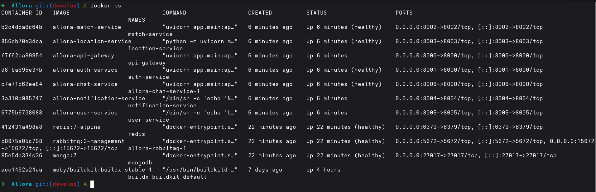
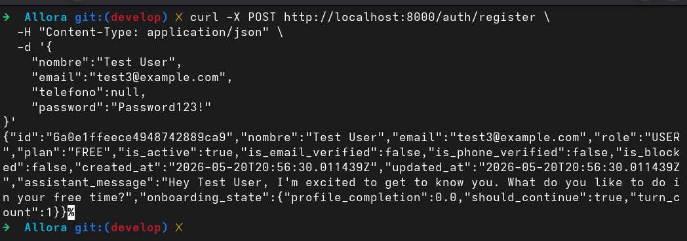
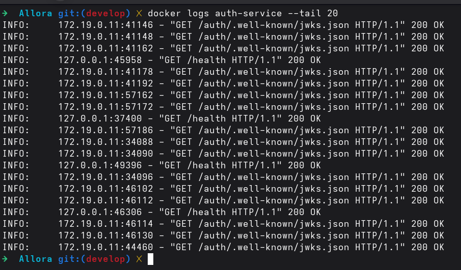
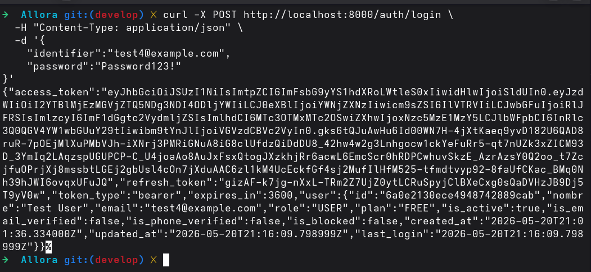
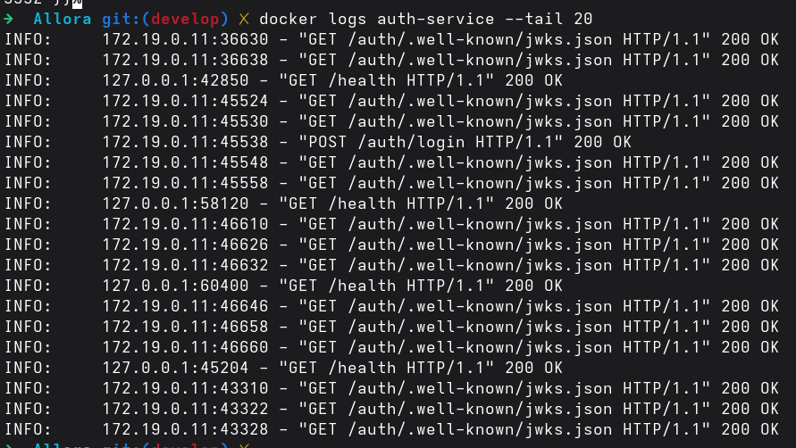
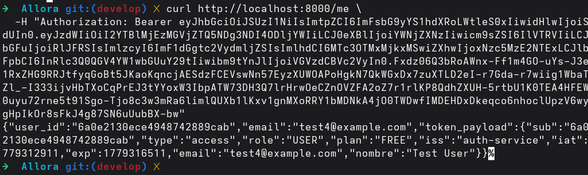
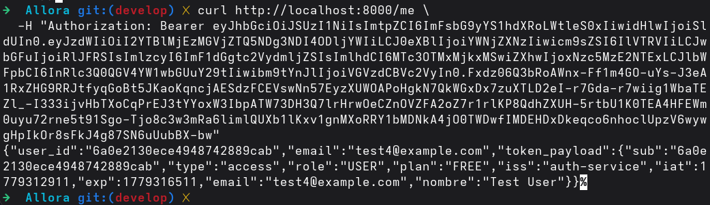
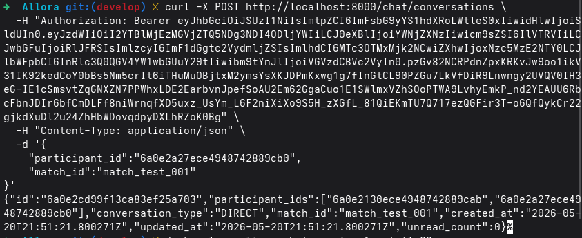
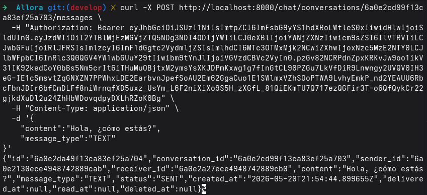
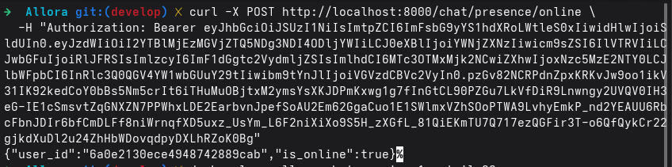

# Pruebas del Sistema

## Objetivo

Validar el correcto funcionamiento de la arquitectura basada en microservicios, incluyendo autenticación, mensajería, persistencia, eventos y comunicación entre servicios.

---

## Entorno de pruebas

Las pruebas fueron ejecutadas en un entorno local utilizando Docker Compose.

### Servicios desplegados

- API Gateway
- Auth Service
- Match Service
- Chat Service
- Notification Service
- User Service
- Location Service
- MongoDB
- Redis
- RabbitMQ

### Herramientas utilizadas

- Docker
- Docker Compose
- curl
- Postman
- RabbitMQ Management
- Redis
- MongoDB

### Estado de los contenedores

Todos los servicios iniciaron correctamente y reportaron estado `healthy`.

### Evidencia del entorno

#### Estado de contenedores



---


# 1. Registro de usuario

## Objetivo

Validar el funcionamiento del Auth Service mediante el API Gateway, verificando el registro correcto de usuarios y la persistencia de información en MongoDB.

## Endpoint utilizado

```http
POST /auth/register
```

## Request

```json
{
  "nombre":"Test User",
  "email":"test4@example.com",
  "telefono":null,
  "password":"Password123!"
}
```

## Response exitosa
```json
{
  "id":"6a0e2130ece4948742889cab",
  "nombre":"Test User",
  "email":"test4@example.com",
  "role":"USER",
  "plan":"FREE",
  "is_active":true,
  "is_email_verified":false,
  "is_phone_verified":false,
  "is_blocked":false,
  "created_at":"2026-05-20T21:01:36.334089Z",
  "updated_at":"2026-05-20T21:01:36.334089Z"
}
```
## Resultado obtenido

El usuario fue registrado exitosamente mediante el API Gateway.

El Auth Service procesó correctamente la solicitud y persistió la información del usuario en MongoDB.

La respuesta HTTP fue `201 Created`.

## Evidencias

### Ejecución del registro de usuario



### Logs del Auth Service



## Estado de la prueba

✅ Exitosa

---


# 2. Inicio de sesión

## Objetivo

Validar el proceso de autenticación mediante el Auth Service, verificando la generación de tokens JWT y refresh tokens para el acceso a rutas protegidas.

## Endpoint utilizado

```http
POST /auth/login
```

## Request

```json
{
  "identifier":"test4@example.com",
  "password":"Password123!"
}
```

## Response exitosa

```json
{
  "access_token":"<jwt_token>",
  "refresh_token":"<refresh_token>",
  "token_type":"bearer",
  "expires_in":3600,
  "user":{
    "id":"6a0e2130ece4948742889cab",
    "nombre":"Test User",
    "email":"test4@example.com",
    "role":"USER",
    "plan":"FREE"
  }
}
```

## Resultado obtenido

El usuario inició sesión correctamente mediante el API Gateway.

El Auth Service validó las credenciales y generó exitosamente un Access Token JWT y un Refresh Token.

La respuesta HTTP fue `200 OK`.

## Evidencias

### Ejecución del login



### Logs del Auth Service



## Estado de la prueba

✅ Exitosa

---


# 3. Usuario autenticado

## Objetivo

Validar el acceso a rutas protegidas mediante JWT, verificando la autenticación y autorización del usuario a través del API Gateway.

## Endpoint utilizado

```http
GET /me
```

## Headers

```txt
Authorization: Bearer <access_token>
```

## Response exitosa

```json
{
  "user_id":"6a0e2130ece4948742889cab",
  "email":"test4@example.com",
  "token_payload":{
    "sub":"6a0e2130ece4948742889cab",
    "type":"access",
    "role":"USER",
    "plan":"FREE",
    "iss":"auth-service",
    "email":"test4@example.com",
    "nombre":"Test User"
  }
}
```

## Resultado obtenido

El API Gateway validó correctamente el JWT enviado en el encabezado Authorization.

La ruta protegida permitió el acceso al usuario autenticado y devolvió correctamente la información contenida en el token.

La respuesta HTTP fue `200 OK`.

## Evidencias

### Validación de JWT mediante /me



### Logs del API Gateway



## Estado de la prueba
✅ Exitosa

---

# 4. Creación de conversación

## Objetivo

Validar la comunicación con el Chat Service mediante el API Gateway, verificando la creación de conversaciones privadas entre usuarios autenticados.

## Endpoint utilizado

```http
POST /chat/conversations
```

## Headers

```txt
Authorization: Bearer <access_token>
```

## Request

```json
{
  "participant_id":"6a0e2a27ece4948742889cb0",
  "match_id":"match_test_001"
}
```

## Response exitosa

```json
{
  "id":"6a0e2cd99f13ca83ef25a703",
  "participant_ids":[
    "6a0e2130ece4948742889cab",
    "6a0e2a27ece4948742889cb0"
  ],
  "conversation_type":"DIRECT",
  "match_id":"match_test_001",
  "created_at":"2026-05-20T21:51:21.800271Z",
  "updated_at":"2026-05-20T21:51:21.800271Z",
  "unread_count":0
}
```

## Resultado obtenido

El Chat Service creó correctamente una conversación privada entre ambos usuarios autenticados.

La solicitud fue procesada exitosamente mediante el API Gateway y la conversación fue persistida correctamente.

La respuesta HTTP fue `201 Created`.

## Evidencias

### Creación de conversación



## Estado de la prueba

✅ Exitosa


---


# 5. Envío de mensajes

## Objetivo

Validar el funcionamiento del Chat Service mediante el envío de mensajes dentro de una conversación privada entre usuarios autenticados.

## Endpoint utilizado

```http
POST /chat/conversations/{conversation_id}/messages
```

## Headers

```txt
Authorization: Bearer <access_token>
```

## Request

```json
{
  "content":"Hola, ¿cómo estás?",
  "message_type":"TEXT"
}
```

## Response exitosa

```json
{
  "id":"6a0e2da49f13ca83ef25a704",
  "conversation_id":"6a0e2cd99f13ca83ef25a703",
  "sender_id":"6a0e2130ece4948742889cab",
  "receiver_id":"6a0e2a27ece4948742889cb0",
  "content":"Hola, ¿cómo estás?",
  "message_type":"TEXT",
  "status":"SENT",
  "created_at":"2026-05-20T21:54:44.899655Z",
  "delivered_at":null,
  "read_at":null,
  "deleted_at":null
}
```

## Resultado obtenido

El Chat Service procesó correctamente el envío del mensaje entre ambos usuarios.

La conversación fue actualizada exitosamente y el mensaje quedó almacenado con estado `SENT`.

La respuesta HTTP fue `201 Created`.

## Evidencias

### Mensaje enviado correctamente



## Estado de la prueba

✅ Exitosa


---

# 6. Presencia de usuario

## Objetivo

Validar el sistema de presencia en tiempo real mediante el Chat Service, verificando el cambio de estado de un usuario autenticado a modo online.

## Endpoint utilizado

```http
POST /chat/presence/online
```

## Headers

```txt
Authorization: Bearer <access_token>
```

## Response exitosa

```json
{
  "user_id":"6a0e2130ece4948742889cab",
  "is_online":true
}
```

## Resultado obtenido

El Chat Service actualizó correctamente el estado de presencia del usuario autenticado.

El sistema registró exitosamente el usuario como conectado (`online`) y respondió correctamente mediante el API Gateway.

La respuesta HTTP fue `200 OK`.

## Evidencias

### Usuario marcado como online



## Estado de la prueba

✅ Exitosa


---

# Conclusiones

Las pruebas realizadas permitieron validar el correcto funcionamiento de los principales componentes de la arquitectura basada en microservicios.

Se comprobó exitosamente:

- Registro de usuarios.
- Inicio de sesión y autenticación.
- Generación y validación de JWT.
- Acceso a rutas protegidas mediante API Gateway.
- Comunicación entre servicios.
- Validación de requests y manejo de errores.

Asimismo, las pruebas realizadas permitieron validar la interacción entre distintos microservicios mediante el API Gateway, incluyendo autenticación, conversaciones privadas, mensajería y presencia de usuarios en tiempo real.